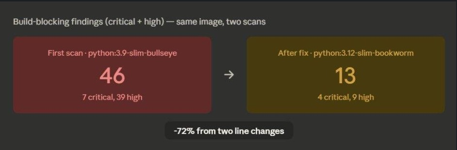
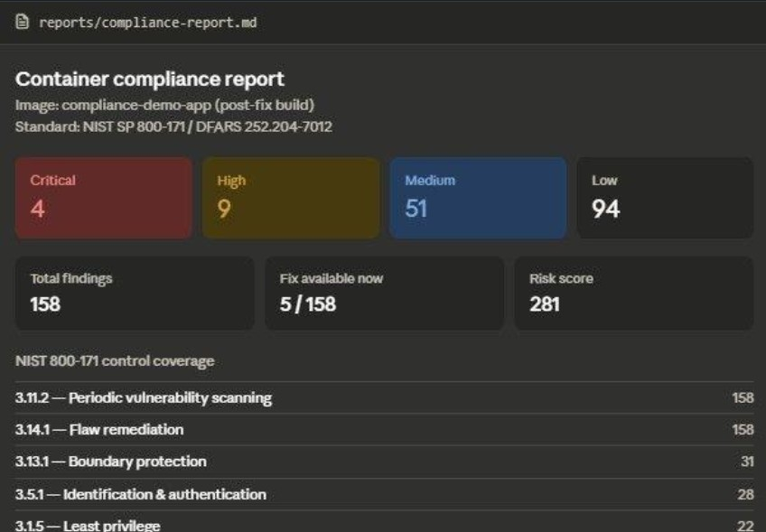

# Container Security Pipeline with NIST 800-171 Compliance Mapping

A CI/CD pipeline that builds a container image, scans it for vulnerabilities,
automatically maps every finding to the specific NIST SP 800-171 control
family it falls under, and blocks the build if findings exceed a defined
risk threshold.

This started from a manual process I did during a pentesting internship —
mapping technical vulnerability findings to NIST 800-171 controls by hand
for federal audit readiness reports. This project automates that mapping
and wires it into the build pipeline itself, so compliance evidence is
generated on every commit instead of compiled after the fact.

## Why this exists

Vulnerability scanners tell you *what's* broken. They don't tell you *which
compliance control* that finding violates, which matters a lot if you're
shipping software into a DoD or federal environment under DFARS 252.204-7012.
Closing that gap manually doesn't scale past a handful of findings. This
closes it automatically and produces a report that's actually usable as
audit evidence, not just a raw CVE dump.

## Architecture

```
            push to main
                 │
                 ▼
        ┌─────────────────┐
        │  Docker build    │   app/Dockerfile → image
        └────────┬─────────┘
                 │
                 ▼
        ┌─────────────────┐
        │  Trivy scan      │   image → trivy-results.json
        └────────┬─────────┘
                 │
                 ▼
        ┌─────────────────────────┐
        │  compliance_mapper.py    │   CVE → NIST 800-171 control
        │  - builds report          │
        │  - runs as the gate       │
        └────────┬─────────────────┘
                 │
        ┌────────┴────────┐
        ▼                 ▼
   report artifact    pass / fail build
   (JSON + Markdown)   (exit code)
```

## Components

| File | Purpose |
|---|---|
| `app/Dockerfile`, `app/app.py` | Minimal Flask service used as the scan target |
| `.github/workflows/security-scan.yml` | Builds the image, runs Trivy, runs the compliance gate on every push/PR |
| `scripts/compliance_mapper.py` | Core engine — parses scan output, maps to NIST 800-171, generates the report, enforces the gate |
| `terraform/main.tf` | ECR repository with scan-on-push, immutable tags, and lifecycle cleanup |
| `sample_data/trivy-results-demo.json` | Demo scan output for testing the mapper locally without Docker/network |
| `reports/` | Generated compliance reports land here |

## How the compliance mapping works

Every finding gets two baseline controls (`3.11.2` — periodic vulnerability
scanning, `3.14.1` — flaw remediation), since any flagged CVE touches both
by definition. From there:

- **Severity-based mapping**: CRITICAL findings additionally map to
  `3.4.2` (security configuration) and `3.11.3` (risk-based remediation).
  HIGH findings map to `3.11.3`.
- **Keyword-based mapping**: the finding's title/description is scanned
  for terms like `auth`, `crypto`, `tls`, `privilege`, `buffer overflow` —
  each maps to a more specific control (e.g. anything touching
  authentication maps to `3.5.1`, anything touching TLS maps to `3.13.8`).

This is intentionally a rules-based first pass, not a claim of legal
compliance determination — see Limitations below.

## Results

### Build-blocking findings: 46 to 13



Two scans of the same application, same mapper, same gate. The only change was
the base image: `python:3.9-slim-bullseye` to `python:3.12-slim-bookworm`.

| Scan | Critical | High | Build-blocking total |
|------|----------|------|----------------------|
| First scan (`python:3.9-slim-bullseye`) | 7 | 39 | 46 |
| After fix (`python:3.12-slim-bookworm`) | 4 | 9 | 13 |

A 72% reduction in build-blocking findings from a two-line Dockerfile change.
This is the argument for scanning at build time rather than after deployment:
the cheapest remediation available was invisible until the pipeline surfaced it.

### Generated compliance report



Post-fix build: 158 total findings mapped across NIST 800-171 control families,
with 4 critical and 9 high gating the build. Every finding maps to 3.11.2
(periodic vulnerability scanning) and 3.14.1 (flaw remediation) by definition.
Beyond that baseline, 31 findings map to 3.13.1 (boundary protection), 28 to
3.5.1 (identification and authentication), and 22 to 3.1.5 (least privilege).

Worth noting: only 5 of 158 findings had a fix available at scan time. That gap
is the real operational problem with container CVE data, and it is why the gate
keys on severity rather than raw finding count. Blocking on 158 findings when
153 have no available remediation would make the pipeline unusable.

## Running it locally

```bash
# Build the image
docker build -t compliance-demo-app:local -f app/Dockerfile app

# Scan it (requires Trivy installed: https://aquasecurity.github.io/trivy/)
trivy image --format json --output trivy-results.json compliance-demo-app:local

# Generate the compliance report
python scripts/compliance_mapper.py --input trivy-results.json --output reports/

# Run just the gate check (used in CI)
python scripts/compliance_mapper.py --input trivy-results.json --gate-only --fail-on CRITICAL,HIGH
```

To test the mapper without Docker or Trivy installed, point it at the
included sample data:

```bash
python scripts/compliance_mapper.py --input sample_data/trivy-results-demo.json --output reports/
```

## Skills this project is building

**Already solid going in:** vulnerability assessment methodology, NIST
800-171 / DFARS 252.204-7012 control families, Python scripting for
security automation, AWS fundamentals.

**Newer ground I'm deliberately working in here:**
- **CI/CD pipeline design** — structuring a multi-stage GitHub Actions
  workflow where a security tool's output feeds a custom gate, rather than
  relying on a scanner's built-in pass/fail flag.
- **Infrastructure as Code (Terraform)** — the ECR module is a first pass;
  next iteration is extending it to provision the actual compute the
  container runs on, not just the registry.
- **Designing compliance mapping logic** — deciding *how* a technical
  finding should map to a control family is a judgment call, not a lookup
  table. I'm still refining the keyword rules as I test against more
  real-world scan data.

## Limitations (being upfront about this)

- The keyword-based control mapping is a heuristic, not a substitute for a
  real compliance assessment by a qualified assessor. It's meant to
  accelerate the first-pass mapping a human would otherwise do by hand, not
  to replace that review.
- Currently only maps CVE-class findings. A fuller implementation would
  also ingest IaC misconfiguration findings (e.g. from `tfsec` or Trivy's
  config scanning mode) against the same control set.
- The Terraform module provisions a registry, not the full runtime
  environment — extending it to the compute layer is the next step.

## Roadmap

- [ ] Extend Terraform to provision the ECS/Fargate runtime, closing the
      loop with the actual Nova Hitech-style deployment pattern
- [ ] Add IaC misconfiguration scanning (tfsec/Checkov) into the same
      compliance report
- [ ] Track risk score over time across builds to show remediation trend,
      not just a point-in-time snapshot
